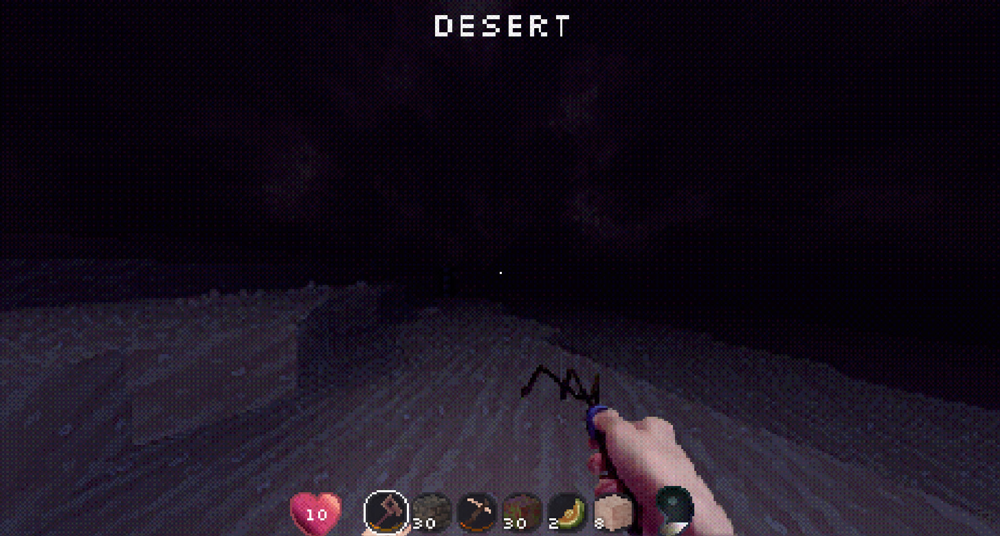

# Dreamers Titles 

## Description

Dreamers Titles is a simple mod for **Lucid Blocks** that displays a title on the screen whenever you enter a new biome.

The mod is inspired by **Traveler's Titles Mod** from Minecraft and the **"New Area" titles** from the Dark Souls series.

When the player enters a new biome, the mod will:

* Display the biome name (and perhaps some interesting information about it) at the top of the screen.
* Play a small sound
* Fade the title in and out smoothly

Purpose

This mod is intentionally simple.

I created it mainly to start my journey into making mods for Lucid Blocks and to experiment with the game's modding system.



## Installation

1. Download the `.pck` file.
2. Place it inside a `mods` folder next to `lucid-blocks.exe`.

Example:

```
Lucid Blocks/
 ├ lucid-blocks.exe
 └ mods/
     └ dreamer_titles.pck
```

3. Start the game. The mod will load automatically.

